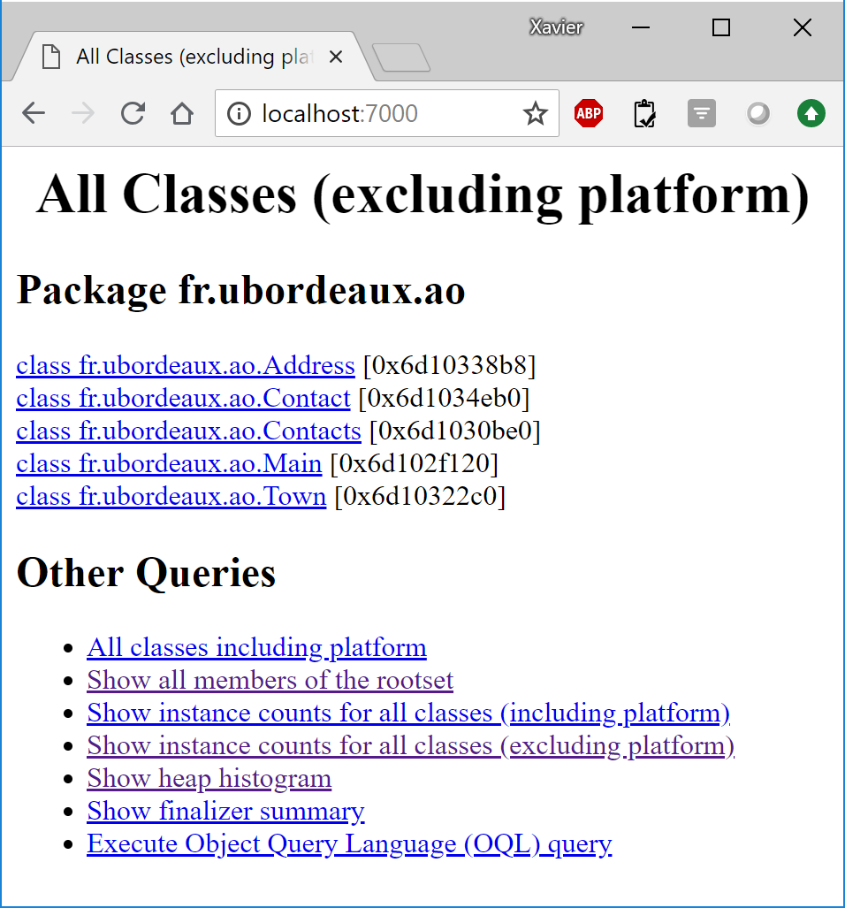

# TD1

Ce TD a pour objectif de :

* Connaitre et exécuter Javac
* Connaitre et exécuter Gradle
* Mieux comprendre les différents types de classe
* Compter le nombre d'objets présents dans une machine vituelle
* Concevoir un service (optionel)
* Concevoir un dépôt (optionel)

## Javac & Java

En utilisant Javac, compilez le code situé dans le répertoire td1/src/main/java et faites en sorte que les classes compilées se retrouvent dans le répertoire td1/classes:

    javac .\src\main\java\fr\ubordeaux\ao\*.java -d classes

En utilisant Java, exécutez le code que vous venez de compiler:
    
    java -cp ./classes fr.ubordeaux.ao.Main

## Gradle

En utilisant Gradle, compiler le code du TD1

    gradle compileJava

En utilisant Gradle, exécuter le test du TD1

    gradle test

## Rôle des classes (Architecture DDD)

Regardez le code du TD1. Celui-ci représente une application de gestion de contacts. 

Identifiez pour chaque classe :
* l'état des objets instances de la classe (les propriétés en précisant celles qui sont immuables)
* les traitements des objets instances de la classes (les méthodes accéssibles en précisant celles qui changent l'état)

Adress:
* Etat
  * number : immutable
  * street : immutable
  * town immutable
* Traitement
  * getNumber : ne change pas l'état
  * getStree : ne change pas l'état
  * getTown : ne change pas l'état

SearchEngine
* Etat
  * 
* Traitement
  * searchByName : ne change pas l'état
  * filterIn : ne change pas l'état

Contact
* Etat
  * firstName : immutable
  * secondName : immutable
  * address mutable
  * mails : le contenu peut changer
  * phones : le contenu peut changer
* Traitement
  * getFirstName : ne change pas l'état
  * changeAddress : change l'état
  * ...

## Objets et Machine Virtuelle

Vous allez utiliser les outils **jps**, **jmap** et **jhat** pour analyser la machine virtuelle Java et compter le nombre d'objets Java créés.

### JPS

L'utilitaire **jps** permet d'identifier les programmes Java en cours d'exécution. Chaque programme est identifié par un numéro.
Exécutez le TD1 puis, dans une autre console de votre shell, exécutez jps pour connaître le numéro du programme.

Par exemple suivant, le Shell1 exécute le TD1.

    Shell1:> java -cp ./classes fr.ubordeaux.ao.Main
    3000 contacts created ! 

Puis le Shell2 exécute **jps**. On voit que l'exécution du TD1 est en cours. Elle s'appelle **Main** et est identifiée par le numéro **82148**.

    Shell2:> jps
    49572 org.eclipse.equinox.launcher_1.5.100.v20180611-1436.jar
    82148 Main
    33528 Jps

### JMAP

L'utilitaire **jmap** permet de construire un dump d'une exécution et de la sauver dans un fichier pour analyser l'état de la machine Virtuelle.

En continuant l'exemple, et toujours pendant que le TD1 s'exécute, l'exécution de **jmap** construit un dump de la machine virtuelle et le sauve dans le fichier **C:/tmp/x.dmp**

    Shell2:> jmap -dump:file=C:/tmp/x.dmp 82148

### JHAT

Enfin, l'utilitaire **jhat** propose des analyses du fichier dump et permet notamment de compter le nombre d'objets construits.

En continuant l'exemple, l'utilitaire **jhat** lance un serveur web sur le port 7000 qui présente les analyses de la machine virtuelle.

    Shell2:> jhat C:/tmp/x.dmp
    Reading from C:\tmp\x.dmp...
    Dump file created Thu Jul 26 20:24:03 CEST 2018
    Snapshot read, resolving...
    Resolving 42227 objects...
    Chasing references, expect 8 dots........
    Eliminating duplicate references........
    Snapshot resolved.
    Started HTTP server on port 7000
    Server is ready.

Avec un navigateur web (Chrome), il est possible d'ouvrir la page **http://localhost:7000** et ainsi voir le résultat de l'analyse.

### A vous de jouer

* Utilisez **jps**, **jmap** et **jhat** pour compter combien d'objets sont créés lors de l'exécution du TD1.
* Modifier le code pour qu'il n'y ait qu'un seul objet pour la ville Talence (et non pas 3000).
* Dans le code, modifiez la valeur de **MAX** pour connaître le nombre maximal d'objets qu'il est possible de loger en mémoire avant de faire crasher la VM

    En suivant les instructions on peut voir que l'objet ville est construit 3000 fois. C'est parce qu'il est construite à chaque itération. Il suffit de sortir la construction de l'itération.

    Cet exercice a pour objectif de montrer que la conception s'intéresse aux objets (leurs relations, quand ils sont construits et détruits). C'est différent de l'algo qui s'intéresse à la résolution des problèmes. Un bon algo peut donner de mauvaises perfs avec une mauvaise conception. Un mauvais algo ne donnera jamais de bonnes perfs mais une bonne conception peut l'optimiser (cacher des résultats déjà calculés par exemple.

## Concevoir un service (optionnel)

Ajoutez un service qui permet de chercher un contact dans votre liste à partir d'un nom ou d'un prénom (on entre une chaîne de charactères et on obtient les contacts dont les noms ou les prénoms ressemblent très fortement à cette chaîne de charactères).

    Voir le code !

## Concevoir un dépôt (optionnel)

Le fichier [villes_france.csv](villes_france.csv) contient la liste de toutes les villes de France. 
Développez un nouveau dépôt (Towns.java) qui contient toutes les villes de France. Vous pouvez utiliser la classe TownFactory qui construit des Town en lisant dans le fichier.

    Voir le code !